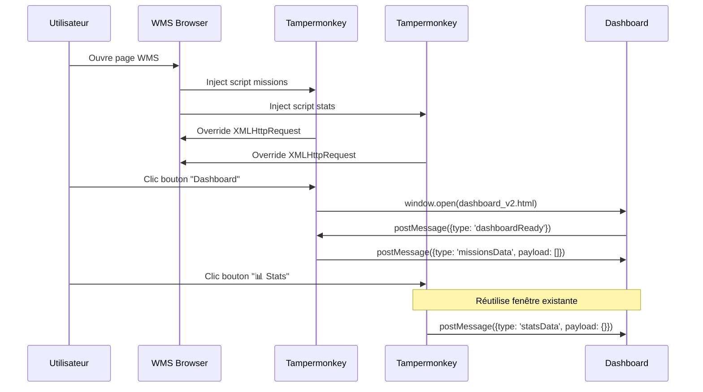
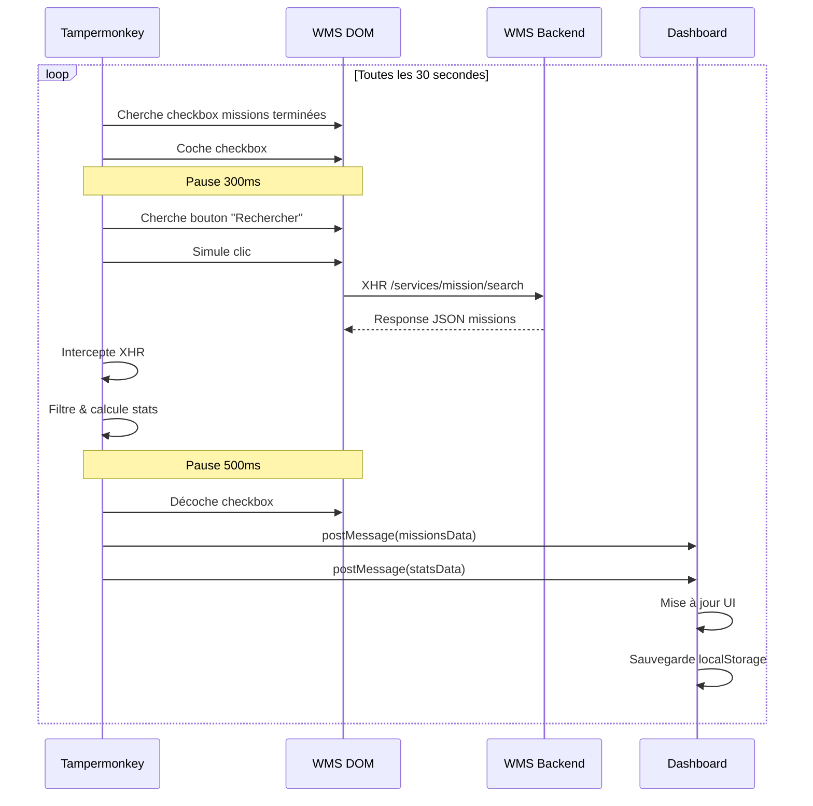

# WMS Dashboard - Documentation Technique

> **Version:** 2.0  
> **Dernière mise à jour:** 27 janvier 2026  
> **Statut:** Production  
> **Mainteneur:** Fab-404

---

## 📋 Table des matières

1. [Vue d'ensemble](#vue-densemble)
2. [Architecture système](#architecture-système)
3. [Stack technique](#stack-technique)
4. [Composants](#composants)
5. [Flux de données](#flux-de-données)
6. [Installation & Configuration](#installation--configuration)
7. [API & Interfaces](#api--interfaces)
8. [Sécurité & Performance](#sécurité--performance)
9. [Maintenance & Évolution](#maintenance--évolution)
10. [Troubleshooting](#troubleshooting)

---

## 🎯 Vue d'ensemble

### Contexte métier

Le WMS Dashboard est une solution de monitoring temps réel pour le système de gestion d'entrepôt (WMS). Il permet de visualiser et suivre l'avancement des missions de préparation de commandes par opérateur et par tournée de livraison.

### Objectifs

- **Temps réel** : Affichage des missions avec rafraîchissement automatique (30s)
- **Multi-utilisateur** : Suivi individuel par badge opérateur
- **Analytics** : Statistiques globales et par tournée (UL terminées, RAF, pourcentage)
- **Non-intrusif** : Aucune modification du WMS existant
- **Portable** : Dashboard accessible via navigateur web standard

### Périmètre fonctionnel

**Données capturées :**
- Missions de préparation (en cours, en attente)
- États des missions (Est attribuée, Attente)
- Statistiques par tournée (60BEZ, 61ANG, 60MON, 60CAS, 60ANG)
- Informations opérateur (badge, nom)
- Métriques : nombre UL, poids, fiche préparation, position train

**Exclusions :**
- Missions terminées (filtrées côté présentation uniquement)
- Modification des données WMS
- Authentification utilisateur (utilise le contexte WMS)

---

## 🏗️ Architecture système

### Architecture globale

```
┌─────────────────────────────────────────────────────────────────┐
│                         NAVIGATEUR WMS                          │
│  ┌─────────────────────────────────────────────────────────┐   │
│  │                    PAGE WMS (DOM)                        │   │
│  │                 /services/mission/search                 │   │
│  └───────────────────────┬─────────────────────────────────┘   │
│                          │                                      │
│  ┌───────────────────────▼─────────────────┐                   │
│  │     TAMPERMONKEY #1 (Missions)          │                   │
│  │  - Intercepte XHR                       │                   │
│  │  - Filtre missions en cours/attente     │                   │
│  │  - postMessage(missionsData)            │                   │
│  └───────────────────────┬─────────────────┘                   │
│                          │                                      │
│  ┌───────────────────────▼─────────────────┐                   │
│  │     TAMPERMONKEY #2 (Stats)             │                   │
│  │  - Intercepte XHR                       │                   │
│  │  - Calcule stats par tournée            │                   │
│  │  - postMessage(statsData)               │                   │
│  └───────────────────────┬─────────────────┘                   │
│                          │                                      │
│  ┌───────────────────────▼─────────────────┐                   │
│  │     AUTO-REFRESH (30s)                  │                   │
│  │  - Coche checkbox "terminées+en cours"  │                   │
│  │  - Simule clic "Rechercher"             │                   │
│  │  - Décoche checkbox                     │                   │
│  └─────────────────────────────────────────┘                   │
└─────────────────────────────────────────────────────────────────┘
                          │
                          │ window.postMessage (*)
                          │
                          ▼
┌─────────────────────────────────────────────────────────────────┐
│                    FENÊTRE POPUP (Dashboard)                     │
│  ┌─────────────────────────────────────────────────────────┐   │
│  │  TOP BAR - Statistiques temps réel                      │   │
│  │  ┌────────┬─────────┬─────────┬─────────┬─────────┐    │   │
│  │  │ GLOBAL │ 60BEZ   │ 61ANG   │ 60MON   │ 60CAS   │    │   │
│  │  │ 80%    │ 95%     │ 82%     │ 78%     │ 88%     │    │   │
│  │  │ RAF:100│ RAF:12  │ RAF:28  │ RAF:35  │ RAF:18  │    │   │
│  │  │        │Cut 10:30│Cut 11:30│Cut 12:30│Cut 13:00│    │   │
│  │  └────────┴─────────┴─────────┴─────────┴─────────┘    │   │
│  └─────────────────────────────────────────────────────────┘   │
│  ┌─────────────────────────────────────────────────────────┐   │
│  │  GRILLES - Missions par opérateur (2x2 par défaut)     │   │
│  │  ┌──────────────────┐  ┌──────────────────┐            │   │
│  │  │ Badge 1412       │  │ Badge 2019       │            │   │
│  │  │ rita             │  │ vincent.v        │            │   │
│  │  ├──────────────────┤  ├──────────────────┤            │   │
│  │  │ Fiche │Train│UL │  │ Fiche │Train│UL │            │   │
│  │  │ 54988 │ A-B │19 │  │ 54990 │ A   │10 │            │   │
│  │  │ ...   │ ... │.. │  │ ...   │ ... │.. │            │   │
│  │  └──────────────────┘  └──────────────────┘            │   │
│  └─────────────────────────────────────────────────────────┘   │
│                                                                  │
│  localStorage:                                                   │
│  - wmsDashboardMissions (missions)                              │
│  - wmsDashboardStats (stats)                                    │
│  - wmsDashboardConfig (config badges/grilles)                   │
└─────────────────────────────────────────────────────────────────┘
```

### Principe d'architecture

**Pattern : Event-Driven Architecture (EDA)**

- **Producer** : Scripts Tampermonkey (interception XHR)
- **Event Bus** : `window.postMessage` (communication inter-fenêtres)
- **Consumer** : Dashboard HTML (écoute events, mise à jour UI)
- **Storage** : localStorage (persistance locale, fallback)

**Avantages :**
- ✅ Découplage total (scripts ↔ dashboard)
- ✅ Scalabilité (ajout de consumers facile)
- ✅ Résilience (localStorage comme buffer)
- ✅ Pas de serveur tiers nécessaire

---

## 💻 Stack technique

### Frontend

| Technologie | Version | Usage |
|------------|---------|-------|
| **HTML5** | - | Structure dashboard |
| **CSS3** | - | Styles, grilles, animations |
| **JavaScript (Vanilla)** | ES6+ | Logique métier, communication |
| **Tampermonkey** | 5.4.1+ | Injection scripts, interception XHR |

### Hébergement

| Service | Usage | URL |
|---------|-------|-----|
| **GitHub Pages** | Hébergement dashboard | `https://fab-404.github.io/` |
| **GitHub Raw** | Fichiers de config/test | `https://raw.githubusercontent.com/` |

### APIs & Protocoles

- **XMLHttpRequest Interception** : Monkey patching XHR.prototype
- **PostMessage API** : Communication cross-origin sécurisée
- **LocalStorage API** : Persistance côté client (5MB)
- **DOM Events** : Simulation clics, manipulation checkbox

---

## 🧩 Composants

### 1. Script Tampermonkey - Missions (Dashboard250126)

**Fichier :** `Tampermonkey/Dashboard250126`  
**Responsabilité :** Capture et transmission des missions

```javascript
// Métadonnées
// @name         WMS – Dashboard
// @match        file:///*/suiviDesMissions.html*
// @version      2026-01-25.Q
// @grant        none

// Fonctions principales
- interceptXHR() : Override XMLHttpRequest pour capturer /services/mission/search
- filterMissions() : Filtre missions en cours et en attente uniquement
- sendMissions() : Envoie via postMessage au dashboard
- autoRefresh() : Simule clic "Rechercher" toutes les 30s
```

**Format message envoyé :**
```javascript
{
  type: 'missionsData',
  payload: [
    {
      personnel: { badge: '1412', name: 'rita', ... },
      codeFichePreparation: 54988104,
      state: { key: 'EA', label: 'Est attribuée' },
      priority: 2,
      priorityWms: 1545,
      tournee: '60BEZ',
      nombreUl: 19,
      poidsBrut: 88.935,
      posTrain: 'A-B',
      // ... autres champs
    },
    // ...
  ]
}
```

### 2. Script Tampermonkey - Statistiques (WMS_postMessage)

**Fichier :** `Tampermonkey/WMS_postMessage.js`  
**Responsabilité :** Calcul et transmission des statistiques agrégées

```javascript
// Métadonnées
// @name         WMS – Collecteur Stats (postMessage)
// @match        file:///*/suiviDesMissions.html*
// @version      2026-01-27-postMessage-v2
// @grant        none

// Fonctions principales
- interceptXHR() : Override XMLHttpRequest
- computeStats() : Calcule stats par tournée (total, terminé, RAF, %)
- sendStats() : Envoie via postMessage au dashboard
- handleCheckbox() : Coche/décoche checkbox pour inclure terminées
- autoRefresh() : Cycle complet toutes les 30s
```

**Algorithme de calcul des stats :**
```javascript
Pour chaque tournée T dans [60BEZ, 61ANG, 60MON, 60CAS, 60ANG]:
  missions_T = filtrer(missions, mission.tournee === T)
  total_UL = somme(missions_T.nombreUl)
  termine_UL = somme(missions_T où state.label === 'Terminée')
  raf_UL = total_UL - termine_UL
  percent = (termine_UL / total_UL) * 100

Calculer GLOBAL = agrégation de toutes les tournées
```

**Format message envoyé :**
```javascript
{
  type: 'statsData',
  payload: {
    '60BEZ': { total: 150, termine: 142, raf: 8, percent: 94.7 },
    '61ANG': { total: 80, termine: 65, raf: 15, percent: 81.3 },
    '60MON': { total: 120, termine: 95, raf: 25, percent: 79.2 },
    '60CAS': { total: 100, termine: 88, raf: 12, percent: 88.0 },
    '60ANG': { total: 50, termine: 45, raf: 5, percent: 90.0 },
    'GLOBAL': { total: 500, termine: 435, raf: 65, percent: 87.0 }
  }
}
```

### 3. Dashboard HTML (dashboard_v2.html)

**Fichier :** `dashboard_v2.html`  
**Responsabilité :** Interface utilisateur, affichage temps réel

**Sections principales :**

#### A. Top Bar - Statistiques
```html
<div class="top-bar">
  <div class="stats-bar" id="stats-bar">
    <!-- Injecté dynamiquement par renderStats() -->
  </div>
</div>
```

**CSS principal :**
```css
.stats-bar { display: flex; gap: 15px; }
.stat-item { flex-direction: column; padding: 8px 14px; }
.stat-progress { width: 80px; height: 6px; }
.stat-raf { color: #FFB74D; } /* Orange - Alerte */
.stat-cutoff { color: #90CAF9; } /* Bleu - Info */
```

#### B. Grilles - Missions
```html
<div class="slider-container">
  <div class="pages-wrapper" id="pages-wrapper">
    <!-- Injecté dynamiquement par renderDashboard() -->
  </div>
</div>
```

**Configuration :**
- Nombre de grilles : 4, 6, 8, ou 10
- Lignes par grille : Adaptatif selon le nombre de grilles
- Badges affichés : Liste configurable

#### C. Panel de configuration
```html
<div id="config-panel">
  <input type="number" id="grids-per-page" />
  <input type="text" id="badges-list" />
  <button id="config-save-btn">Sauvegarder</button>
</div>
```

**Stockage localStorage :**
```javascript
{
  gridsPerPage: 4,
  badges: ['1412', '2019', '1765', '5555']
}
```

### 4. Module de rendu (wms-dashboard-render.js)

**Fichier :** `Path/wms-dashboard-render.js`  
**Responsabilité :** Logique de tri et rendu des missions

**Fonctions principales :**

```javascript
// Tri des missions (nouveau en v2.0)
sortMissions(missions) {
  // 1. Par état : 'Est attribuée' > 'Attente' > autres
  // 2. Par priority (croissant)
  // 3. Par priorityWms (croissant)
}

// Regroupement par fiche de préparation
groupMissionsByFiche(missions) {
  // Concatène les missions d'une même fiche
  // Format: train "A-B", UL "19-10", etc.
}

// Création du tableau HTML
createTable(badge, nom, missions, maxRows) {
  // Génère <table> avec header badge et lignes missions
}

// Rendu complet
renderDashboard(missions) {
  // 1. Charge config
  // 2. Filtre par badges
  // 3. Trie missions
  // 4. Groupe par fiche
  // 5. Génère grilles
}
```

**Configuration d'affichage :**
```javascript
const ROWS_BY_GRID = {
  4: 8,   // 4 grilles → 8 lignes max par grille
  6: 4,   // 6 grilles → 4 lignes max
  8: 4,   // 8 grilles → 4 lignes max
  10: 4   // 10 grilles → 4 lignes max
};
```

---

## 🔄 Flux de données

### Séquence d'initialisation



### Cycle de rafraîchissement (30s)



### Gestion des événements postMessage

**Émetteur (Tampermonkey) :**
```javascript
function startSendingData() {
  let tries = 0;
  const interval = setInterval(() => {
    tries++;
    if (!dashboardWindow || dashboardWindow.closed) {
      clearInterval(interval);
      return;
    }
    dashboardWindow.postMessage(
      { type: 'missionsData', payload: missions },
      '*'
    );
    if (tries >= 10) clearInterval(interval);
  }, 500);
}
```

**Récepteur (Dashboard) :**
```javascript
window.addEventListener('message', (event) => {
  if (!event.data?.type) return;
  
  switch(event.data.type) {
    case 'missionsData':
      window.missionsData = event.data.payload;
      localStorage.setItem(MISSIONS_KEY, JSON.stringify(missions));
      renderDashboard(window.missionsData);
      break;
      
    case 'statsData':
      window.statsData = event.data.payload;
      localStorage.setItem(STATS_KEY, JSON.stringify(stats));
      renderStats(window.statsData);
      break;
  }
});
```

---

## ⚙️ Installation & Configuration

### Prérequis

- Navigateur moderne (Chrome 90+, Firefox 88+, Edge 90+)
- Extension Tampermonkey installée
- Accès au WMS de l'entreprise
- Connexion Internet (pour charger dashboard depuis GitHub Pages)

### Installation

#### Étape 1 : Installation Tampermonkey

1. Installer l'extension Tampermonkey pour votre navigateur
   - Chrome : [Chrome Web Store](https://chrome.google.com/webstore/detail/tampermonkey/)
   - Firefox : [Firefox Add-ons](https://addons.mozilla.org/firefox/addon/tampermonkey/)
   - Edge : [Microsoft Edge Add-ons](https://microsoftedgeaddons.microsoft.com/addons/detail/tampermonkey/)

#### Étape 2 : Installation des scripts

2. **Script Missions :**
   - Ouvrir Tampermonkey → Create new script
   - Copier le contenu de `Tampermonkey/Dashboard250126`
   - **IMPORTANT :** Modifier la ligne `@match` avec l'URL réelle de votre WMS
   - Sauvegarder (Ctrl+S)

3. **Script Stats :**
   - Ouvrir Tampermonkey → Create new script
   - Copier le contenu de `Tampermonkey/WMS_postMessage.js`
   - **IMPORTANT :** Modifier la ligne `@match` avec l'URL réelle de votre WMS
   - Sauvegarder (Ctrl+S)

#### Étape 3 : Configuration initiale

4. Se connecter au WMS et naviguer vers la page de suivi des missions

5. Vérifier l'apparition de 2 boutons en bas à droite :
   - 🔵 "Dashboard" (bottom: 20px)
   - 🟣 "📊 Stats Dashboard" (bottom: 80px)

6. Cliquer sur "📊 Stats Dashboard" pour ouvrir le dashboard

7. Cliquer sur ⚙️ Config en haut à droite

8. Configurer :
   - **Nombre de grilles** : 4 (défaut recommandé)
   - **Liste des badges** : Saisir les badges à monitorer séparés par virgules
     ```
     Exemple : 1412,2019,1765,5555,0303,4563
     ```

9. Cliquer sur "Sauvegarder"

### Configuration avancée

#### Personnalisation des tournées

Modifier dans `WMS_postMessage.js` :
```javascript
const TOURNEES = ['60BEZ', '61ANG', '60MON', '60CAS', '60ANG'];
```

#### Personnalisation des cut-off

Modifier dans `dashboard_v2.html`, fonction `renderStats()` :
```javascript
const cutoffs = {
  '60BEZ': '10:30',
  '61ANG': '11:30',
  '60MON': '12:30',
  '60CAS': '13:00',
  '60ANG': '11:30'
};
```

#### Modification de la fréquence de rafraîchissement

Par défaut : 30 secondes. Pour modifier :

Dans les 2 scripts Tampermonkey, chercher :
```javascript
setInterval(clickRechercher, 30000); // 30000ms = 30s
```

Changer à la valeur souhaitée (en millisecondes) :
```javascript
setInterval(clickRechercher, 60000); // 60s
setInterval(clickRechercher, 15000); // 15s
```

⚠️ **Attention :** Un intervalle trop court peut surcharger le serveur WMS.

---

## 🔌 API & Interfaces

### Interface postMessage

#### Message : missionsData

**Type :** `missionsData`  
**Direction :** Tampermonkey → Dashboard  
**Fréquence :** Toutes les 30s + à l'ouverture du dashboard

**Payload :**
```typescript
interface MissionsPayload {
  type: 'missionsData';
  payload: Mission[];
}

interface Mission {
  personnel: {
    key: string;
    name: string;
    badge: string;
    equipe: {
      libelle: string;
      id: string;
    };
  };
  key: string;
  codeMission: number;
  type: string;
  state: {
    key: string;
    label: 'Est attribuée' | 'Attente' | 'Terminée';
  };
  priority: number;
  priorityWms: number;
  codeFichePreparation: number;
  aliasSupport: string;
  tournee: string;
  nombreUl: number;
  poidsBrut: number;
  posTrain: string;
  avancement: number;
  // ... autres champs
}
```

#### Message : statsData

**Type :** `statsData`  
**Direction :** Tampermonkey → Dashboard  
**Fréquence :** Toutes les 30s + à l'ouverture du dashboard

**Payload :**
```typescript
interface StatsPayload {
  type: 'statsData';
  payload: {
    [tournee: string]: TourneeStats;
    GLOBAL: TourneeStats;
  };
}

interface TourneeStats {
  total: number;      // Total UL
  termine: number;    // UL terminées
  raf: number;        // Reste à faire
  percent: number;    // Pourcentage (1 décimale)
}
```

**Exemple :**
```json
{
  "type": "statsData",
  "payload": {
    "60BEZ": {
      "total": 150,
      "termine": 142,
      "raf": 8,
      "percent": 94.7
    },
    "GLOBAL": {
      "total": 500,
      "termine": 435,
      "raf": 65,
      "percent": 87.0
    }
  }
}
```

#### Message : dashboardReady

**Type :** `dashboardReady`  
**Direction :** Dashboard → Tampermonkey  
**Fréquence :** Une fois à l'ouverture

**Payload :**
```json
{
  "type": "dashboardReady"
}
```

**Usage :** Signal au script Tampermonkey que le dashboard est prêt à recevoir des données.

### LocalStorage Schema

#### wmsDashboardMissions

**Clé :** `wmsDashboardMissions`  
**Type :** Array<Mission>  
**Usage :** Fallback si postMessage échoue, restauration au reload

```json
[
  {
    "personnel": { "badge": "1412", "name": "rita" },
    "codeFichePreparation": 54988104,
    "state": { "label": "Est attribuée" },
    "priority": 2,
    "nombreUl": 19
  }
]
```

#### wmsDashboardStats

**Clé :** `wmsDashboardStats`  
**Type :** Object<string, TourneeStats>  
**Usage :** Fallback stats, restauration au reload

```json
{
  "60BEZ": { "total": 150, "termine": 142, "raf": 8, "percent": 94.7 },
  "GLOBAL": { "total": 500, "termine": 435, "raf": 65, "percent": 87.0 }
}
```

#### wmsDashboardConfig

**Clé :** `wmsDashboardConfig`  
**Type :** ConfigObject  
**Usage :** Préférences utilisateur

```json
{
  "gridsPerPage": 4,
  "badges": ["1412", "2019", "1765", "5555"]
}
```

---

## 🔒 Sécurité & Performance

### Sécurité

#### Principe de moindre privilège

- ✅ **Aucune permission Tampermonkey élevée** : `@grant none`
- ✅ **Pas d'accès réseau externe** (sauf GitHub Pages pour dashboard)
- ✅ **Aucune modification de la base de données WMS**
- ✅ **Lecture seule** sur les réponses XHR

#### Isolation des données

- ✅ **localStorage** limité à l'origine `fab-404.github.io`
- ✅ **postMessage** avec vérification `event.data?.type`
- ✅ **Pas de XSS** : Usage de `textContent` et création DOM contrôlée

#### Recommandations

⚠️ **Ne jamais commit dans le repo public :**
- Tokens d'authentification
- URLs internes de l'entreprise
- Données réelles (badges, noms complets)

✅ **Bonnes pratiques :**
- Utiliser `.gitignore` pour fichiers de config locaux
- Variables d'environnement pour URLs sensibles
- Logs minimalistes en production

### Performance

#### Optimisations implémentées

| Optimisation | Impact | Description |
|--------------|--------|-------------|
| **Tri en mémoire** | ⚡ High | `sortMissions()` O(n log n) une seule fois |
| **Regroupement par fiche** | ⚡ Medium | Réduit les lignes affichées (~30%) |
| **Pagination virtuelle** | ⚡ Medium | Limite lignes par grille (4-8 max) |
| **localStorage** | ⚡ High | Évite reload complet au rafraîchissement |
| **Event throttling** | ⚡ Low | postMessage toutes les 500ms max |

#### Métriques

**Sur machine de référence (Intel i5, 8GB RAM, Chrome 120) :**

| Métrique | Valeur | Objectif |
|----------|--------|----------|
| **Temps de rendu initial** | ~150ms | < 200ms |
| **Temps mise à jour** | ~50ms | < 100ms |
| **Mémoire dashboard** | ~15MB | < 50MB |
| **Mémoire Tampermonkey** | ~8MB | < 20MB |
| **CPU idle** | ~0.5% | < 2% |
| **CPU lors refresh** | ~5% | < 10% |

#### Limites techniques

| Limite | Valeur | Comportement si dépassée |
|--------|--------|--------------------------|
| **Max missions affichées** | 100 par badge | Affichage "+N lignes non affichées" |
| **Max badges configurés** | 20 | Défilement horizontal |
| **localStorage** | 5MB | Échec silencieux (fallback XHR) |
| **Fréquence refresh min** | 10s | Risque surcharge serveur WMS |

---

## 🛠️ Maintenance & Évolution

### Logs & Monitoring

#### Logs côté Tampermonkey

**Console du navigateur WMS (F12) :**

```
[WMS] missions capturées: 45
[WMS Stats] Mode PROD - Stats calculées: 5 tournées - 435/500 UL (87%)
[18:45:30] [WMS Stats] Checkbox trouvée et cochée ✅
[18:45:30] [WMS Stats] Bouton Rechercher trouvé, clic simulé - Checkbox: ✅
[18:45:31] [WMS Stats] Checkbox décochée après refresh
[WMS] envoi missions (tentative) 1 45
[WMS Stats] envoi stats (tentative) 1 tournées: 5 global: {total: 500, termine: 435}
```

#### Logs côté Dashboard

**Console du dashboard (F12 dans la popup) :**

```
[Dashboard V2] page chargée
[Dashboard V2] missions chargées depuis localStorage: 45
[Dashboard V2] stats chargées depuis localStorage
[Dashboard V2] missions reçues: 45
[Dashboard V2] stats reçues: 6 tournées
[Dashboard V2] stats affichées dans la top bar
[18:45:35] [Dashboard V2] debug - tick 30s - missions: 45, stats: 6
```

### Debugging

#### Problème : Dashboard ne reçoit pas les données

**Checklist :**
1. Vérifier que les 2 scripts Tampermonkey sont activés
2. Ouvrir console WMS → Chercher `[WMS] missions capturées`
3. Ouvrir console Dashboard → Chercher `[Dashboard V2] missions reçues`
4. Vérifier que le dashboard est bien ouvert depuis les boutons Tampermonkey (pas manuellement)
5. Vérifier les popups (ne pas bloquer)

**Tests manuels console WMS :**
```javascript
// Tester postMessage manuellement
dashboardWindow.postMessage({
  type: 'missionsData',
  payload: window.missionsData
}, '*');
```

**Tests manuels console Dashboard :**
```javascript
// Simuler réception de données
fetch('https://raw.githubusercontent.com/Fab-404/fab-404.github.io/refs/heads/main/config/missionData.json')
  .then(r => r.json())
  .then(data => {
    window.postMessage({
      type: 'missionsData',
      payload: data.missions
    }, '*');
  });
```

#### Problème : Stats incorrectes

**Causes possibles :**
1. **Checkbox non cochée** → Missions terminées non incluses
   - Vérifier log : `Checkbox trouvée et cochée ✅`
2. **Tournées manquantes** → Pas de missions pour cette tournée
   - Vérifier `TOURNEES` dans le script
3. **Calcul RAF négatif** → Données incohérentes du WMS
   - Ajouter log debug dans `computeStats()`

#### Problème : Performance dégradée

**Diagnostics :**
```javascript
// Mesurer temps de rendu
console.time('render');
renderDashboard(window.missionsData);
console.timeEnd('render');

// Compter éléments DOM
console.log('Éléments DOM:', document.querySelectorAll('*').length);

// Mémoire
console.log('Mémoire:', performance.memory.usedJSHeapSize / 1048576, 'MB');
```

**Solutions :**
- Réduire nombre de badges affichés
- Augmenter `maxRows` pour réduire le nombre de grilles
- Vider localStorage : `localStorage.clear()`

### Évolutions prévues

#### Roadmap v2.1 (Q1 2026)

- [ ] **Alertes visuelles** : Clignotement si proche du cut-off
- [ ] **Couleurs dynamiques** : Rouge/Orange/Vert selon avancement
- [ ] **Export CSV** : Export des données affichées
- [ ] **Mode sombre** : Toggle thème clair/sombre
- [ ] **Filtres avancés** : Par tournée, par état, par priorité

#### Roadmap v3.0 (Q2 2026)

- [ ] **Historique** : Graphiques d'évolution sur la journée
- [ ] **Notifications** : Alertes navigateur si RAF critique
- [ ] **Multi-dossiers** : Support de plusieurs dossiers (HOUAT, BELLE-ILE...)
- [ ] **API REST** : Backend Node.js optionnel pour analytics
- [ ] **PWA** : Dashboard installable, offline-first

### Contribution

Pour contribuer au projet :

1. Fork le repository
2. Créer une branche feature : `git checkout -b feature/ma-feature`
3. Commit : `git commit -m "Add: description"`
4. Push : `git push origin feature/ma-feature`
5. Créer une Pull Request

**Convention de commit :**
- `Add:` Nouvelle fonctionnalité
- `Fix:` Correction de bug
- `Update:` Amélioration existante
- `Docs:` Documentation uniquement
- `Refactor:` Refactoring sans changement fonctionnel
- `Test:` Ajout/modification de tests

---

## 🆘 Troubleshooting

### Erreurs fréquentes

#### Erreur : "Popup bloquée par le navigateur"

**Cause :** Bloqueur de popups actif

**Solution :**
1. Autoriser les popups pour la page WMS
2. Chrome : Icône popup dans barre d'adresse → "Toujours autoriser"
3. Firefox : Préférences → Vie privée → Exceptions → Ajouter URL WMS

#### Erreur : "Cannot read property 'postMessage' of null"

**Cause :** Dashboard fermé avant l'envoi

**Solution :** Normal, le script détecte automatiquement et arrête l'envoi.

**Prévention :**
```javascript
if (!dashboardWindow || dashboardWindow.closed) {
  clearInterval(sendTimer);
  return;
}
```

#### Erreur : "localStorage quota exceeded"

**Cause :** LocalStorage plein (>5MB)

**Solution :**
1. Ouvrir console Dashboard (F12)
2. Exécuter : `localStorage.clear()`
3. Recharger la page

**Prévention :** Implémenter rotation automatique :
```javascript
// Limiter taille stockée
if (JSON.stringify(missions).length > 1000000) { // 1MB
  missions = missions.slice(-100); // Garder 100 dernières
}
```

### FAQ

**Q : Puis-je utiliser plusieurs dashboards en même temps ?**  
R : Oui, mais attention au nommage des fenêtres. Par défaut, `window.open` avec le même nom réutilise la fenêtre. Pour ouvrir plusieurs dashboards :
```javascript
const timestamp = Date.now();
window.open(url, `dashboard-${timestamp}`, 'width=1200,height=800');
```

**Q : Puis-je changer l'URL du dashboard hébergé ?**  
R : Oui, modifier dans les scripts Tampermonkey :
```javascript
// Remplacer
'https://fab-404.github.io/dashboard_v2.html'
// Par
'https://mon-domaine.com/mon-dashboard.html'
```

**Q : Comment désactiver l'auto-refresh ?**  
R : Commenter dans les scripts Tampermonkey :
```javascript
// window.addEventListener('load', () => {
//   setTimeout(() => {
//     clickRechercher();
//     setInterval(clickRechercher, 30000);
//   }, 1000);
// });
```

**Q : Les données sont-elles sauvegardées entre les sessions ?**  
R : Oui, via localStorage (persistance navigateur). Mais attention : si le navigateur est fermé brutalement ou en navigation privée, les données peuvent être perdues.

**Q : Puis-je ajouter d'autres métriques (poids total, nb fiches, etc.) ?**  
R : Oui, modifier `computeStats()` pour ajouter les calculs souhaités :
```javascript
result[t] = {
  total,
  termine,
  raf,
  percent,
  poidsBrut: all.reduce((s, m) => s + m.poidsBrut, 0),
  nbFiches: new Set(all.map(m => m.codeFichePreparation)).size
};
```

---

## 📚 Ressources

### Documentation externe

- [Tampermonkey Documentation](https://www.tampermonkey.net/documentation.php)
- [MDN - postMessage API](https://developer.mozilla.org/en-US/docs/Web/API/Window/postMessage)
- [MDN - localStorage](https://developer.mozilla.org/en-US/docs/Web/API/Window/localStorage)
- [GitHub Pages Documentation](https://docs.github.com/en/pages)

### Fichiers du projet

| Fichier | Chemin | Description |
|---------|--------|-------------|
| Dashboard HTML | `/dashboard_v2.html` | Interface utilisateur principale |
| Script Missions | `/Tampermonkey/Dashboard250126` | Collecteur missions |
| Script Stats | `/Tampermonkey/WMS_postMessage.js` | Collecteur stats |
| Render Module | `/Path/wms-dashboard-render.js` | Logique de rendu |
| Config Module | `/Path/script-config.js` | Gestion configuration |
| Styles V2 | `/Path/stylev2.css` | Styles dashboard V2 |
| Test Data (en cours) | `/config/missionData.json` | Données test missions en cours |
| Test Data (terminées) | `/config/MissionData_terminer.json` | Données test missions terminées |

### Contact & Support

**Mainteneur :** Fab-404  
**Repository :** [https://github.com/Fab-404/fab-404.github.io](https://github.com/Fab-404/fab-404.github.io)  
**Issues :** [GitHub Issues](https://github.com/Fab-404/fab-404.github.io/issues)

---

## 📄 Licence & Droits

Ce projet est développé pour un usage interne à l'entreprise. Tous droits réservés.

**Restrictions :**
- ❌ Diffusion externe interdite sans autorisation
- ❌ Usage commercial interdit
- ✅ Modifications internes autorisées
- ✅ Partage interne autorisé

---

## 📝 Changelog

### v2.0.0 (27 janvier 2026)

**Nouvelles fonctionnalités :**
- ✨ Statistiques temps réel par tournée dans top bar
- ✨ Affichage RAF (Reste À Faire) et Cut-off par tournée
- ✨ Tri intelligent des missions (état → priority → priorityWms)
- ✨ Gestion automatique checkbox missions terminées
- ✨ Double localStorage (missions + stats)
- ✨ Mode DEV avec chargement GitHub pour tests locaux

**Améliorations :**
- 🎨 Top bar agrandie et redesignée
- 🎨 Badges stats avec barres de progression
- 🎨 Couleurs distinctives (GLOBAL vert, RAF orange, Cut-off bleu)
- ⚡ Performance : tri O(n log n) optimisé
- 📝 Logs améliorés avec timestamps et statuts

**Corrections :**
- 🐛 Fix : postMessage échouait si dashboard fermé pendant l'envoi
- 🐛 Fix : localStorage quota exceeded sur gros volumes
- 🐛 Fix : Checkbox restait cochée après refresh

### v1.0.0 (25 janvier 2026)

**Version initiale :**
- ✨ Dashboard missions par badge
- ✨ Interception XHR WMS
- ✨ Communication postMessage
- ✨ Configuration badges/grilles
- ✨ Auto-refresh 30s
- ✨ Regroupement par fiche de préparation

---

**Dernière mise à jour de la documentation :** 27 janvier 2026  
**Version du document :** 2.0  
**Format :** Markdown (.md)
